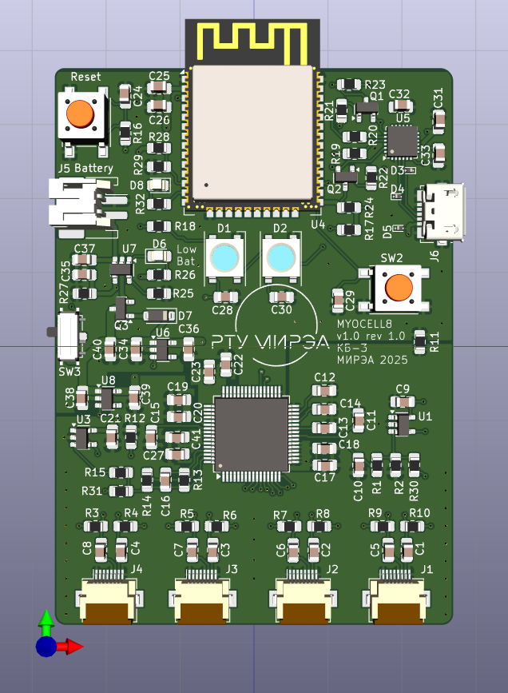

# ADC+CPU board for multiboard myocell design

ADC + CPU board for multiboard MYOCELL design. Includes [ADS1298(4)](https://static.chipdip.ru/lib/395/DOC009395274.pdf) and [ESP32-WROOM-32E](https://www.espressif.com/sites/default/files/documentation/esp32-wroom-32e_esp32-wroom-32ue_datasheet_en.pdf). Design based on ideas from [HeartyPatch](https://hackaday.io/project/21046-heartypatch-a-single-lead-ecg-hr-patch-with-esp32), [Adafruit ESP32 Feather boards](https://learn.adafruit.com/adafruit-huzzah32-esp32-feather/downloads), etc.

## Gerbers

* [ESP32-WROOM-32E Datasheet Version 1.7](https://www.espressif.com/sites/default/files/documentation/esp32-wroom-32e_esp32-wroom-32ue_datasheet_en.pdf) 
* [ESP32-DevKitC-V4 Reference Design r2.1](https://www.espressif.com/en/products/devkits/esp32-devkitc/resources)

## Dependencies

* [Espressif KiCad Library](https://github.com/espressif/kicad-libraries)
